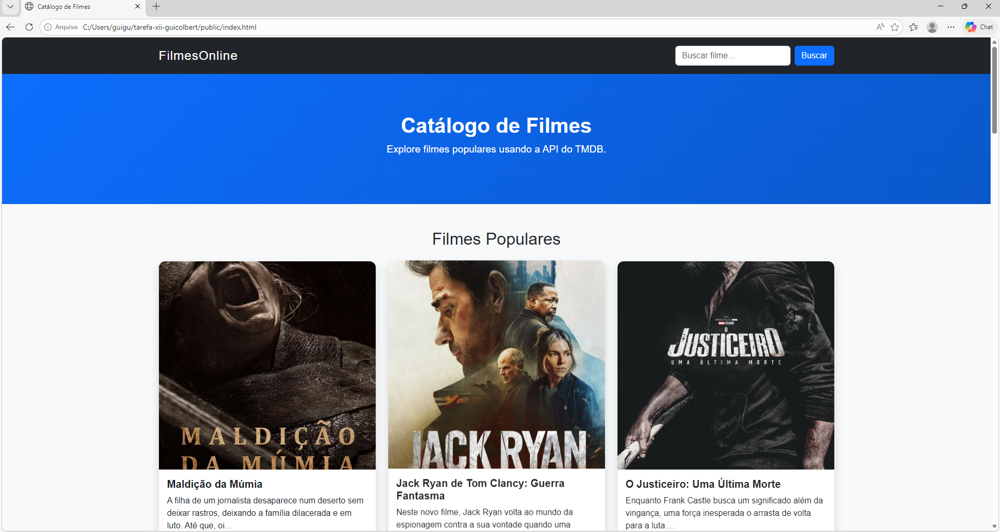
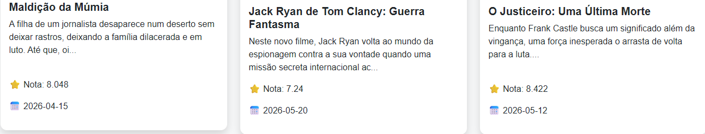
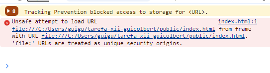

# Trabalho Prático - Semana 12

Nesta atividade, você vai utilizar a Fetch API para consumir dados reais de filmes a partir da The Movie DB (TMDBLinks to an external site.) e montar uma página que liste os resultados em cards, incluindo uma funcionalidade de pesquisa ou filtro. A ideia é que você pratique o fluxo completo de requisição assíncrona → tratamento dos dados → renderização no DOM → interação do usuário.

A atividade foi pensada para ser concluída em até 1h no laboratório, usando Visual Studio Code e um navegador.

 

Habilidades a serem trabalhadas
Consumo de APIs externas por meio de requisições assíncronas com Fetch API
Processamento de dados em JSON retornado pela APIs RESTful
Apresentação dinâmica de dados em páginas via manipulação do DOM
Implementação de lógicas de programação para montagem de componentes e pesquisa ou filtro de dados
Tratamento básico de erros em requisições

## Informações Gerais

- Nome:Guilherme Ales Colbert Camara
- Matricula:909422

## Prints do trabalho

